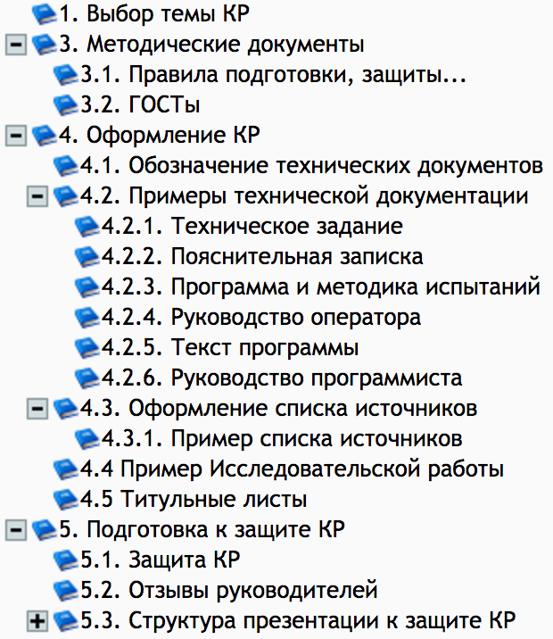

# Information about 4th module in the HSE Software engineering
#education

## Даты:
4 модуль — с 03.04 по 30.06
Сессия — с 19.06 по 30.06
Каникулы — с 1.05 по 9.05. ~10 мая (среда) учебный день.~
12 июня – праздничный день.

## Список ссылок на программы предметов 4 модуля:
* [Алгоритмы и структуры данных](https://www.hse.ru/data/2017/01/13/1117080146/program-725594847-awEzeK1y71.pdf)
* [Операционные системы](https://www.hse.ru/data/2016/09/15/1117077413/program-725594643-MNlsFZdxCB.pdf)
* [Конструирование программного обеспечения](https://www.hse.ru/data/2016/09/27/1117077645/program-725595969-bXk4nZ8DMO.pdf)
* [Статистические и эмпирические методы компьютинга](https://www.hse.ru/data/2017/04/25/1117092411/program-725595390-4qcCzE3F5h.pdf)
* [Экономика фирмы](https://www.hse.ru/data/2016/08/31/1117076670/program-725595844-63ny_Lp0of.pdf)
* Майнор
* Курсовая работа

Взято [отсюда](https://www.hse.ru/ba/se/courses?course=2.1.2.4&page=1&year=2016) .

## Курсовая работа:
1. В ЛМС есть дисциплина **12387 Курсовой проект 2016-2017**, к которой подключены все студенты 1-3 курсов ПИ
2. В материалах этой дисциплины размещены: ~ГОСТы~, ~Образцы технической документации~, ~Образец отчета по курсовой работе исследовательского формата~, ~методические материалы по подготовке к защите курсовых~, информация о том, как подготовиться к защите и как проходят защиты.

3. До защиты курсовой в проект дисциплины **12387 Курсовой проект 2016-2017** надо будет [загрузить все материалы к защите](http://lms.hse.ru/?ap_list) . В противном случае оценка за КР ~не будет выставлена~ в электронную зачетку.
4. Для получения отзыва на курсовую работу надо ~не позже, чем за  5 дней до защиты~ предоставить научному руководителю работу.
5. **НЕ ПОЗЖЕ**, чем ~за 1 рабочий день~ (те, кто сдает 22 мая это 19 мая) сдать отчет в бумажном виде в учебный офис. В отчете должно быть:
	- отзыв научного руководителя с подписью;
	- правильно оформленная работа с подписью научного руководителя, академического руководителя;
	- QR-код (если процент заимствования больше допустимых 20%), то научный руководитель должен проверить причину и написать свои комментарии в отзыве или на листе с QR-кодом);
	- носитель: диск или флешка;
	- работа должна быть оформлена в файлы и **ПАПКУ**. **УЧЕБНЫЙ ОФИС НЕ ОБЕСПЕЧИВАЕТ СТУДЕНТОВ КАНЦТОВАРАМИ** – побеспокойтесь об этом **ЗАРАНЕЕ**.
6. За 1 день до защиты документы выкладываются в LMS в раздел «Проекты». Все формы и требования есть в LMS. Если у кого-то не открываются «Проекты», напишите об этом Ахметсафиной Римме Закиевне заранее.
 
> Студенты, не предоставившие работы за 1 день и не выполнившие требования к отчету, не будут допущены до защиты.  

### Организационная информация по курсовой работе:
1. [Распределение по дням и кабинетам](https://docs.google.com/spreadsheets/d/10cs9lFXhia7X9yVl5WAY8RNvK7xUUadJFByslvoYTeM/edit?usp=sharing)
2. [Правила подготовки к защите и сдаче отчетов по курсовой работе](https://www.hse.ru/ba/se/projects)

По всем вопросам о курсовой работе писать Ахметсафинов Римме Закиевне: rakhmetsafina@hse.ru